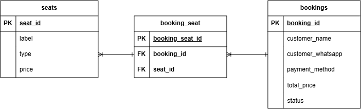

# ⚙️ Xione Theatre Ticketing System - Backend

REST API for Xione Theatre Ticketing System, built to handle seat reservation, booking management, and admin operations for an annual theatre ticketing event.

> Frontend repository: [xione-frontend](https://github.com/Monnn-03/xione-frontend)

---

## Features

- **Admin Authentication** — token-based login using Laravel Sanctum
- **Seat Availability** — public endpoint listing all seats and their current status
- **Seat Reservation** — instant seat locking; a seat becomes unavailable to other guests as soon as a booking is created, pending admin confirmation
- **Auto-Cancellation (Smart-timer)** — a scheduled console command (`app:prune-bookings-v2`) runs every minute and removes `pending` bookings older than 15 minutes, automatically freeing the seat back up
- **Admin Booking Management** — view all bookings, confirm or reject pending ones

---

## Tech Stack

- PHP 8.2
- Laravel 12.0
- Laravel Sanctum 4.0 (Authentication)
- MySQL
- REST API
- Laravel Task Scheduling (for smart-timer auto-cancellation)

---

## Architecture

```
Routes
  ↓
Controllers
  ↓
Services
  ↓
Models
  ↓
Database
```

---

## ⏱ Key Technical Highlight: Seat Reservation & Smart-timer Auto-Cancellation

To prevent two guests from booking the same seat and to avoid a seat being locked indefinitely by a booking that's never confirmed by an admin, seat reservation is handled with the following approach:

**1. Availability check wrapped in a database transaction**

```php
$booking = DB::transaction(function () use ($validated, $seatIds, &$totalPrice) {

    $bookedSeats = Seat::whereIn('id', $seatIds)
        ->whereIn('id', function ($query) {
            $query->select('seat_id')
                ->from('booking_seat')
                ->join('bookings', 'bookings.id', '=', 'booking_seat.booking_id')
                ->where('bookings.status', 'confirmed')
                ->orWhere(function ($q) {
                    $q->where('bookings.status', 'pending')
                      ->where('bookings.created_at', '>', Carbon::now()->subMinutes(15));
                });
        })->pluck('label');

    if ($bookedSeats->isNotEmpty()) {
        throw new \Exception("Maaf, kursi " . $bookedSeats->implode(', ') . " sudah terisi.");
    }

    // ...create booking, attach seats
});
```

A seat is considered unavailable if it belongs to either a `confirmed` booking, or a `pending` booking created within the last 15 minutes — matching the auto-cancellation window below, so a seat is never shown as available while its hold is still active.

**2. Scheduled auto-cancellation for abandoned bookings**

```php
class PruneOldBookings extends Command
{
    protected $signature = 'app:prune-bookings-v2';

    public function handle()
    {
        $expiredThreshold = Carbon::now('Asia/Jakarta')->subMinutes(15);

        $deletedCount = Booking::where('status', 'pending')
            ->where('created_at', '<=', $expiredThreshold)
            ->delete();
    }
}
```

Scheduled via `routes/console.php`:

```php
Schedule::command('app:prune-bookings-v2')->everyMinute();
```

Every minute, the scheduler checks for `pending` bookings older than 15 minutes and deletes them, freeing the seat back up for other guests — without requiring a queue/job system.

**Known limitation:** the availability check above does not currently use row-level locking (`lockForUpdate()`) on the seat query. `DB::transaction()` guarantees the booking creation is atomic and rollback-safe, but it does not by itself lock the rows being read — so in a narrow window (near-simultaneous requests within milliseconds), two guests could theoretically both pass the availability check before either insert completes. Given the system serves a single annual event with a modest number of concurrent users, this risk is low in practice, but a stricter fix (row locking or a unique constraint) would close the gap entirely.

---

## Installation

```bash
git clone https://github.com/Monnn-03/xione-ticketing-backend.git

cd xione-ticketing-backend

composer install

cp .env.example .env

php artisan key:generate

php artisan migrate

php artisan serve
```

To keep the smart-timer running locally, also run the scheduler:

```bash
php artisan schedule:work
```

---

## API Documentation

### Public

```
GET    /api/seats              List all seats and availability
POST   /api/bookings           Create a new booking (guest reservation)
POST   /api/admin/login        Admin login
```

### Admin (requires `auth:sanctum`)

```
GET    /api/admin/bookings              Get all bookings
PUT    /api/admin/bookings/{id}/confirm Confirm a pending booking
DELETE /api/admin/bookings/{id}         Reject / delete a booking
POST   /api/admin/logout                Admin logout
GET    /api/admin/user                  Get currently authenticated admin
```

### Example: Create Booking

```
POST /api/bookings

Request Body:
{
  "customer_name": "Budi Santoso",
  "customer_whatsapp": "081234567890",
  "payment_method": "online",
  "seats": [12, 13]
}

Response (201):
{
  "message": "Pesanan berhasil dibuat!",
  "booking_id": 45
}

Response (409 - seat already taken):
{
  "message": "Maaf, kursi A12 sudah terisi."
}
```

Note: only admin actions require authentication (Sanctum). Guest booking creation is a public endpoint, with the seat immediately locked upon submission pending admin review.

---

## Database

ERD



---

## Environment Variables

Key variables to configure in `.env` (see `.env.example` for the full list):

```
DB_CONNECTION=mysql
DB_DATABASE=
DB_USERNAME=
DB_PASSWORD=
```

The application uses Laravel's default session, queue, and cache drivers (`database`), so no additional service configuration (Redis, S3, mail provider) is required to run the project locally.

---

## Connected Frontend

https://github.com/Monnn-03/xione-frontend

---

## My Contribution

- Designed REST API
- Developed business logic
- Built seat reservation & instant locking mechanism
- Implemented smart-timer auto-cancellation for expired pending bookings
- Built admin booking management (confirm/reject flow)
- Database design
- Authentication (Laravel Sanctum)
- Deployment

---

## License

This is a proprietary project developed for a client. Source code is shared here for portfolio purposes only, with permission from the client.